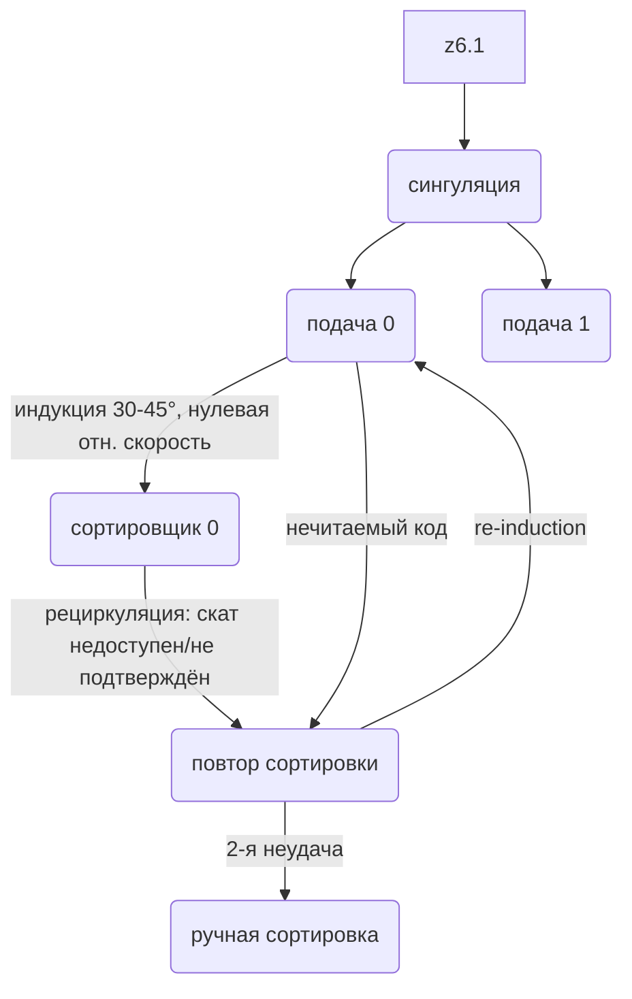

# Отчёт: путь товара через инфиды и сортировщики, повторный прогон и ручная сортировка

Источник схемы: `src\r-03\prompts\resources\sc-mermaid.md` (mermaid, зоны и потоки СЦ).
Цель отчёта — подробно объяснить, как товары попадают на инфиды (зона подачи), затем на сортировщик; что происходит при неудачной сортировке (повторный прогон) и при повторной неудаче (ручная сортировка); как весь процесс полностью автоматизируется; как устроены сортировщики (10 шт — по заданию) и как движутся товары.

---

## 1. Термины схемы и соответствие спецификации

| Схема sc-mermaid.md | Спецификация / проект | Примечание |
|---|---|---|
| зона разрузки | З. 1 приёмка (6–8 ворот) | входные грузовики |
| зона роллтейнеров / зона паллет | разукрупнение, сток тары | паллеты и роллтейнеры |
| распаллетирование | З. 2 разукрупнение | депаллетайзеры 3–4 шт |
| вскрытие ящиков | З. 3 вскрытие (8–10 машин) | срез скотча, выемка товаров |
| подача 0..9 | З. 5 подача (инфиды), 10 шт | **по 1 инфиду на сортировщик** |
| сортировщик 0..9 | З. 6 сортировка, 10 кросс-белт линий | **10 сортировщиков — как в задании** |
| повтор сортировки 0..9 | З. 12 возвратные потоки | каналы повторного прогона/отбраковки |
| ручная сортировка | З. 11 nonsort | 400 адресных ячеек, 250 товаров/ч на чел. |
| сбор в ящики 0..9 | этап заполнения у скатов линий | ящик направления, ≤ 30 кг |
| сортировка ящиков | З. 8 сортировка ящиков + буфер | 400 ячеек направлений |
| сбор в паллеты / роллтейнеры | З. 9 паллетирование / роллтейнер-станции | 20 ящиков/паллета |
| накопитель | буфер отгрузки | ≈ 370 паллетомест |
| доки 24 шт | З. 10 отгрузка, 24 ворота | исходящие грузовики |

Схема корректно отражает главное: **10 подач → 10 сортировщиков**, у каждого сортировщика свой контур «ошибка → повтор → снова сортировщик → ручная сортировка».

---

## 2. Пошаговый путь товара (шаг за шагом)

### Шаг 1. Приёмка (доки 6 шт → зона разгрузки)
- Входящие грузовики разгружаются у 6–8 ворот; из кузова — **паллеты и роллтейнеры** с упакованными ящиками.
- Паллеты → зона паллет, роллтейнеры → зона роллтейнеров (разделение тары).

### Шаг 2. Распаллетирование и вскрытие
- Депаллетайзеры снимают ящики с паллет (порожние паллеты уходят в накопитель → на повторное паллетирование).
- Ящики попадают на вскрытие: машины срезают скотч **без повреждения ящика** (80 % ящиков возвращаются в оборот).
- После вскрытия товары делятся на два потока:
  - **ручная ветка** (з5.1 → z7.1): сразу ручная сортировка (форма, хрупкость, негабарит) — либо по прямому решению, либо по результату отбора;
  - **автосортировка** (z6.1): товары идут на 10 подач.

### Шаг 3. Попадание товара на инфиды (зона подачи) — ключевой узел автоматизации
Товары физически попадают на инфид так:
1. **Конвейер-распределитель** от вскрытия раздаёт товары на 10 линий подач (merge/split, балансировка очередей по загрузке линий).
2. **Сингуляция** (bulk singulator): из навала товары выстраиваются «гуськом», с одинаковым зазором (gapping). Без сингуляции индукция теряет темп: на инфиде ошибки «двойной подачи» растут.
3. **Идентификация**: считывание штрих-кода (или OCR адресной этикетки) — до или на инфиде; при неудачном считывании товар уже здесь помечается исключением («нечитаемый код») и уходит в контур повторной подачи, не занимая слот сортировщика.
4. **Контроль параметров**: взвешивание (weigh-in-motion), измерение габаритов (dimensioner). Данные (код, вес, размеры, адрес назначения) уходят в WMS/контроллер сортировщика.
5. **Буфер перед индукцией**: короткая накопительная секция сглаживает пульсации (пики выше номинала режутся буфером, иначе растёт доля отказов индукции).
6. **Индукция (подача на ленту сортировщика)**: ускоряющие (ленточные) конвейеры разгоняют товар до скорости сортировщика; подача идёт под углом 30–45° к направлению движения; в момент передачи скорость товара = скорости ячейки (**нулевая относительная скорость** — товар «ложится» на ячейку без броска). Один товар занимает 1–2 ячейки (по габаритам).

### Шаг 4. Сортировщик: как устроен и как движется товар
Кросс-белт сортировщик — это **замкнутая петля** (linear loop) из тележек-кареток, собранных в поезда:
- **Каретка (carrier)** — колёсная платформа; на ней **ячейка (cell)** — короткая поперечная лента со своим мотором/актуатором. Товар лежит на ячейке ПОПЕРЁК движения.
- **Привод** — линейные синхронные моторы (LSM, бесконтактно) вдоль трассы; типичная скорость **2–2,5 м/с** для посылок (пик до 3 м/с).
- **Питание ячеек** — индуктивная передача энергии (IPT) или шина; **связь** — промышленный Wi-Fi (каждая ячейка знает свою позицию и получает команду сброса).
- **Движение товара**: ячейка с товаром едет по петле; контроллер отслеживает позицию каждой ячейки (энкодеры, датчики подтверждения); когда ячейка достигает назначенного ската — поперечная лента включается и **выталкивает товар вбок** (влево/вправо) в скат. Сброс плавный (без гравитации) — товары хрупкие не повреждаются.
- **Точка сброса** может динамически подстраиваться (по габаритам/весу) для равномерного заполнения скатов.
- **Скаты** расположены вдоль обеих сторон петли; у кросс-белтов скаты можно ставить плотно (высокая плотность направлений). В нашем проекте: 40 скатов на линию, 10 линий → 400 направлений.
- **Производительность**: `Пропускная способность = Скорость (м/ч) × Ячеек на каретке × КПД / Шаг каретки (м)`. При 2,5 м/с (9 000 м/ч), шаге каретки 0,9–1 м и КПД ~0,9: 9 000 × 0,9 / 0,9 ≈ **9–10 тыс. товаров/ч на линию** — ровно наш расчёт ТЗ. Современные машины с несколькими индукциями (2–3 точки ввода) выдают 20–36 тыс./ч на линию, поэтому **10 000/ч на линию — консервативная, гарантированно достижимая величина**.

### Шаг 5. Сброс в скат → сбор в ящики (этап заполнения)
- Товар сбрасывается на скат направления; под скатом стоит **ящик** этого направления (установка пустых ящиков — у скатов линий, «сбор в ящики» z13.x на схеме).
- Контроль заполняемости (вес ≤ 30 кг, объём), утряска; заполненный ящик съезжает на конвейер → заклейка (З. 7) → сортировка ящиков (З. 8, 400 ячеек) → паллетирование/роллтейнеры → буфер → отгрузка (24 ворота).

### Шаг 6. Неудачная сортировка → повторный прогон
«Ошибка сортировки» в реальной системе — это один из трёх случаев:
1. **Считывание не подтвердилось** после индукции (код не прочитался повторно) — адрес неизвестен;
2. **Скат недоступен** (ящик на скате заполнен/снят, скат в ремонте, затор — chute congestion);
3. **Сброс не подтверждён** (товар проехал мимо ската — mis-throw).

Механизмы повтора:
- **Рециркуляция (recirculation)**: товар **остаётся на петле** и делает ещё один круг мимо индукции; система повторно назначает ему скат (или ждёт освобождения). Это штатный режим «повтор сортировки» — товар не покидает сортировщик.
- **Reject-канал (канал исключений)**: если код не читается — товар выбрасывается на специальный канал и конвейером возвращается на **повторную подачу (re-induction)**: снова сканирование, снова индукция (z11.x → z10.x на схеме).
- На схеме sc-mermaid это отражено узлом «повтор сортировки»: `сортировщик → ошибка → повтор → товары → сортировщик`.

### Шаг 7. Повторная неудача → ручная сортировка
- Если после повтора товар снова не сортируется (2-я неудача: код по-прежнему не читается, товар негабаритный/нестандартный, вес вне допуска) — он направляется в **канал отбраковки** (`ошибка повтора сортировки → z7.1`).
- Каналы повторного прогона/отбраковки — наша З. 12 (возвратные потоки).
- Далее товар попадает в **ручную сортировку (З. 11 nonsort)**: оператор видит товар и этикетку, определяет адрес, кладёт в **адресную ячейку** (400 шт); из ячеек товары комплектуются в **роллтейнеры** (по направлениям) → отгрузка. Норматив: 250 товаров/ч на человека.

---

## 3. Полная автоматизация процесса

| Узел | Автоматизация |
|---|---|
| Разгрузка | автоматические распаллетайзеры; роботы-перевозчики возят паллеты/роллтейнеры |
| Вскрытие | автоматы среза скотча (8–10 машин), без участия людей |
| Распределение по подачам | конвейерная сеть + WMS-балансировка очередей |
| Сингуляция | автоматические сингуляторы (bulk singulator) с обратной связью с индукцией |
| Инфиды | сканеры/весы/габаритомеры; индукция с нулевой относительной скоростью |
| Сортировка | кросс-белт: LSM-привод, IPT, Wi-Fi; назначение скатов и рециркуляция — контроллером без человека |
| Исключения | автоматический повторный прогон (рециркуляция) и re-induction |
| Ящики | установка пустых ящиков у скатов (роботы-перевозчики), взвешивание/контроль заполнения, автозаклейка, маркировка |
| Сортировка ящиков | автоматическая (400 направлений) |
| Паллетирование | паллетайзеры 4–6 шт; роботы-перевозчики доставляют паллеты в буфер |
| Отгрузка | планирование волн WMS, расписание магистрали |

**Люди остаются только** на ручной сортировке (З. 11), на контроле качества/ремонте и в обслуживании машин. Процесс «подача → сортировка → повтор → отбраковка» полностью автоматизирован: единственная человеческая точка в контуре исключений — ручная сортировка после 2-й неудачи.

---

## 4. Улучшения схемы sc-mermaid.md (шаг за шагом)

1. **Добавить зону сингуляции** перед подачами: `вскрытие → сингуляция → подачи 0..9`. Без неё индукция — узкое место.
2. **Показать буфер перед индукцией** (накопительные секции на каждой подаче).
3. **Уточнить повтор**: на кросс-белте повтор чаще реализуется рециркуляцией на петле, а не внешним каналом; предложение: подписать ребро `сортировщик → повтор` как «рециркуляция / скат недоступен», а `повтор → сортировщик` как «re-induction».
4. **Добавить поток «нечитаемый код»** прямо на инфиде → повторная подача (не занимает слоты сортировщика).
5. **Обратные потоки тары**: на схеме нет возврата пустых ящиков (80 %) и порожних паллет на повторное использование; добавить `сортировка ящиков → вскрытие/сток` и `паллетирование → распаллетирование`.
6. **Указать производительности**: 10 сортировщиков × 10 000 товаров/ч; на ребрах — интенсивности.
7. **Ручную сортировку (z7.1) связать с отгрузкой роллтейнеров** (сейчас роллтейнеры z17 → z22 идут только из ветки автосортировки).

Пример улучшенного фрагмента:

---

## 5. Источники (проверено в интернете)

- Wikipedia, «Cross belt sorter»: компоненты (induction area, track, train, carrier, cells, control system, discharge points), подача под 30–45°, нулевая относительная скорость, LSM до 3 м/с (2,5 м/с для посылок), IPT, Wi-Fi, рециркуляция на горизонтальной петле, формула производительности, множественная индукция (3 × 12 000 = 36 000/ч), плотность скатов.
- SmartLoadingHub, «Cross-Belt Sorter Induction: Practical Decision Checklist»: индукционная станция как узел точности, сингуляция, RFQ-параметры (профиль товара, пики нагрузки), контроль ошибок сброса, обслуживание.
- Honeywell, «Sorting Out Your Sortation Options»: петлевые сортировщики с несколькими индукциями и встроенной рециркуляцией для подтверждения сброса.
- BEUMER Group, кейс PostNord (Veddesta): автоматический сингулятор, связанный с индукционной линией петлевого сортировщика.
- GlobalscopePro, «Parcel Handling Automation Bottlenecks»: причины рециркуляции (неравномерная индукция, заторы скатов), рост долей исключений.

---

## 6. Выводы

1. Путь товара: **приёмка → распаллетирование → вскрытие → сингуляция → инфид (скан/вес/габариты) → индукция → сортировка на кросс-белт петле → скат → ящик**.
2. Неудачная сортировка: **рециркуляция на петле / re-induction** (повторный прогон); 2-я неудача → **канал отбраковки → ручная сортировка** (адресные ячейки → роллтейнеры → отгрузка).
3. Процесс автоматизируем полностью до точки исключений; 10 сортировщиков × 10 000 товаров/ч соответствуют реальным характеристикам кросс-белт машин (консервативная загрузка).
4. Схема sc-mermaid.md требует доработки: сингуляция, буферы, рециркуляция, обратные потоки тары, интенсивности (раздел 4).