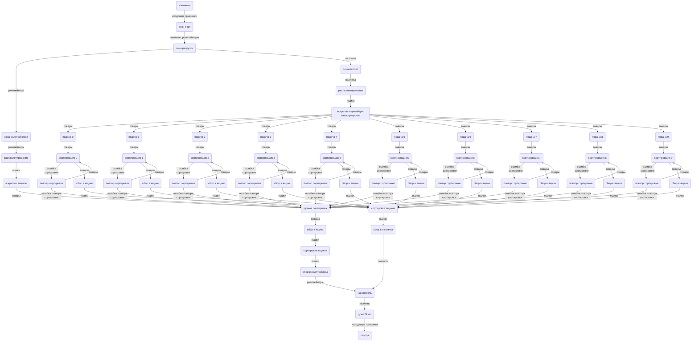

```mermaid

flowchart TD
 z0(компании) -->|входящие грузовики| z1(доки 6 шт)
 
 z1 -->|паллеты, роллтейенры| z2(зона разрузки)
 
 z2 --> |роллтейнеры| z2.1(зона роллтейнеров)
 z2 --> |паллеты| z2.2(зона паллет)

z2.1 --> |роллтейнеры|z3.3(распаллетирование)
z2.2  --> |паллеты|z4.6(распаллетирование)

z3.3 --> |ящики| z5.1(вскрытие ящиков)
z4.6 --> |ящики| z6.1(вскрытие ящиков\для автосортировки)

z5.1 -->  |товары| z7.1(ручная сортировка)

z7.1 -->  |товары| z8.1(сбор в ящики)

z8.1 --> |ящики| z16.1(сортировка ящиков)

z16.1 --> |ящики| z17(сбор в роллтейнеры)
z17 --> |роллтейнеры| z22

z6.1 --> |товары| z9.0(подача 0)
z6.1 --> |товары| z9.1(подача 1)
z6.1 --> |товары| z9.2(подача 2)
z6.1 --> |товары| z9.3(подача 3)
z6.1 --> |товары| z9.4(подача 4)
z6.1 --> |товары| z9.5(подача 5)
z6.1 --> |товары| z9.6(подача 6)
z6.1 --> |товары| z9.7(подача 7)
z6.1 --> |товары| z9.8(подача 8)
z6.1 --> |товары| z9.9(подача 9)

z9.0 --> |товары| z10.0(сортировщик 0)
z9.1 --> |товары| z10.1(сортировщик 1)
z9.2 --> |товары| z10.2(сортировщик 2)
z9.3 --> |товары| z10.3(сортировщик 3)
z9.4 --> |товары| z10.4(сортировщик 4)
z9.5 --> |товары| z10.5(сортировщик 5)
z9.6 --> |товары| z10.6(сортировщик 6)
z9.7 --> |товары| z10.7(сортировщик 7)
z9.8 --> |товары| z10.8(сортировщик 8)
z9.9 --> |товары| z10.9(сортировщик 9)

z10.0 --> |ошибка\nсортировки| z11.0(повтор сортировки)
z11.0 --> |товары| z10.0
z11.0 --> |ошибка повтора\nсортировки| z7.1

z10.1 --> |ошибка\nсортировки| z11.1(повтор сортировки)
z11.1 --> |товары| z10.1
z11.1 --> |ошибка повтора\nсортировки| z7.1

z10.2 --> |ошибка\nсортировки| z11.2(повтор сортировки)
z11.2 --> |товары| z10.2
z11.2 --> |ошибка повтора\nсортировки| z7.1

z10.3 --> |ошибка\nсортировки| z11.3(повтор сортировки)
z11.3 --> |товары| z10.3
z11.3 --> |ошибка повтора\nсортировки| z7.1

z10.4 --> |ошибка\nсортировки| z11.4(повтор сортировки)
z11.4 --> |товары| z10.4
z11.4 --> |ошибка повтора\nсортировки| z7.1

z10.5 --> |ошибка\nсортировки| z11.5(повтор сортировки)
z11.5 --> |товары| z10.5
z11.5 --> |ошибка повтора\nсортировки| z7.1

z10.6 --> |ошибка\nсортировки| z11.6(повтор сортировки)
z11.6 --> |товары| z10.6
z11.6 --> |ошибка повтора\nсортировки| z7.1

z10.7 --> |ошибка\nсортировки| z11.7(повтор сортировки)
z11.7 --> |товары| z10.7
z11.7 --> |ошибка повтора\nсортировки| z7.1

z10.8 --> |ошибка\nсортировки| z11.8(повтор сортировки)
z11.8 --> |товары| z10.8
z11.8 --> |ошибка повтора\nсортировки| z7.1

z10.9 --> |ошибка\nсортировки| z11.9(повтор сортировки)
z11.9 --> |товары| z10.9
z11.9 --> |ошибка повтора\nсортировки| z7.1

 z10.0 --> |товары| z13.0(сбор в ящики)
z10.1 --> |товары| z13.1(сбор в ящики)
z10.2 --> |товары| z13.2(сбор в ящики)
z10.3 --> |товары| z13.3(сбор в ящики)
z10.4 --> |товары| z13.4(сбор в ящики)
 z10.5 --> |товары| z13.5(сбор в ящики)
z10.6 --> |товары| z13.6(сбор в ящики)
z10.7 --> |товары| z13.7(сбор в ящики)
z10.8 --> |товары| z13.8(сбор в ящики)
z10.9 --> |товары| z13.9(сбор в ящики)

 z13.0 --> |ящики| z16(сортировка ящиков)
 z13.1 --> |ящики| z16(сортировка ящиков)
 z13.2 --> |ящики| z16(сортировка ящиков)
 z13.3 --> |ящики| z16(сортировка ящиков)
 z13.4 --> |ящики| z16(сортировка ящиков)
 z13.5 --> |ящики| z16(сортировка ящиков)
 z13.6 --> |ящики| z16(сортировка ящиков)
 z13.7 --> |ящики| z16(сортировка ящиков)
 z13.8 --> |ящики| z16(сортировка ящиков)
 z13.9 --> |ящики| z16(сортировка ящиков)

z16 --> |ящики| z20(сбор в паллеты)

z20 --> |паллеты| z22(накопитель)

z22 --> |паллеты| z25(доки 24 шт)

z25 --> |исходящие грузовики| z100(города)
```